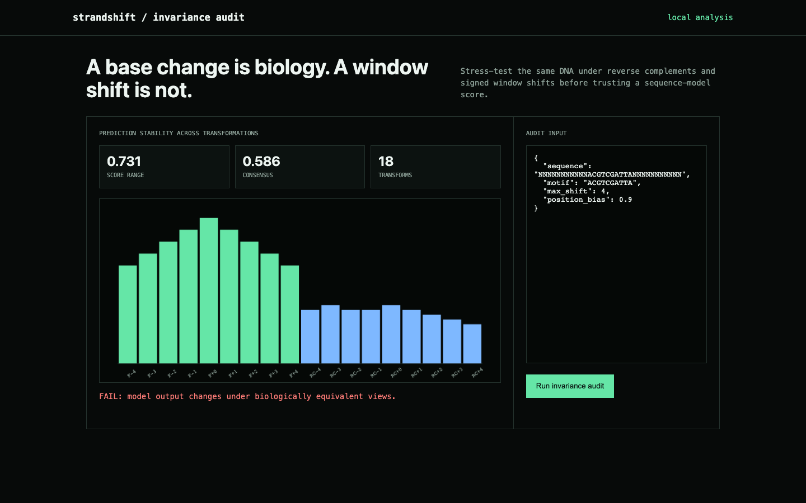

# strandshift

**Genomic sequence-model invariance auditor.**

Audit sequence classifiers across reverse complements and shifted windows before trusting variant-effect scores.




## Why this exists

DNA foundation models are increasingly used for sequence classification and variant-effect prediction. A model can still change its answer when the same local biology is reverse-complemented or moved a few bases inside the input window. `strandshift` turns those transformations into a reproducible release gate.

## What ships

- Forward, reverse-complement, and signed window-shift transforms
- Transparent proxy model plus a stable JSON audit contract for external predictions
- CLI, JSON API, responsive local workbench, Docker image, tests, and CI
- No API keys and no sequence uploads

## Run it end to end

```bash
python -m venv .venv && source .venv/bin/activate
python -m pip install -e .
strandshift demo
strandshift serve
```

Open <http://127.0.0.1:8090>. Analyze JSON with `strandshift analyze input.json`.

## Demo result

The committed sequence is evaluated under 18 strand/shift transformations. The deliberately brittle proxy model exposes a large prediction spread (a 0.33 range, 0.18 max consensus deviation) and fails a 0.05 invariance budget; the full per-transform trace makes the failure reproducible.

**Update:** roughly half of the originally reported instability (a 0.73
range, not 0.33) was itself a bug, not the model's genuine strand
sensitivity. The reverse-complement transforms were scored against the
*original* motif string instead of its reverse complement — the way the
same biological signal actually appears once the whole sequence is
flipped. That manufactured a near-guaranteed "failure" on every
reverse-complement prediction regardless of the model's real behavior.
Fixed to score each strand against its correctly oriented motif; the
audit still fails (the position-sensitive proxy model genuinely is
strand- and shift-brittle), just with an honest magnitude. Details below.

## The reverse-complement audit was scored against the wrong motif

Reverse-complementing a sequence reverse-complements *everything inside
it*, including any motif occurrence — the same underlying biological
signal appears as `reverse_complement(motif)` on the flipped strand, not
as the original motif spelling. `analyze()` scored every
reverse-complement transform against the unmodified `motif` string
instead, which checks whether the literal forward-strand spelling
happens to reappear by chance after RC (it structurally almost never
does) — not whether the model recognizes the same signal on the other
strand.

```python
demo_model(reverse_complement(sequence), motif, position_bias)              # what it did: 0.40
demo_model(reverse_complement(sequence), reverse_complement(motif), position_bias)  # what it should do: 1.00
```

Verified directly on the demo fixture: scoring the reverse-complemented
sequence against the reverse-complemented motif gives a perfect 1.0 match
at zero shift, exactly matching the forward strand's own baseline —
confirming the underlying signal genuinely is present and recognizable on
both strands. Scored against the wrong (un-complemented) motif, the same
comparison lands at 0.40, entirely an artifact of comparing against the
wrong reference, not the model's real behavior.

Fixed by using the correctly oriented motif per strand. The published
instability numbers dropped by roughly half (prediction range 0.7309 →
0.3273, max consensus deviation 0.4145 → 0.1818) — but the audit still
fails, because the demo model's deliberate position sensitivity (it
favors motif matches near the center of the window, per the
`position_bias` parameter) is a real, separate source of window-shift
brittleness that the bug fix doesn't touch. `tests/test_reverse_complement_motif.py`
covers the corrected RC scoring directly, and the pre-existing instability
test's threshold was updated to the corrected, honest number.

## Research basis

- [Nucleotide Transformer: building and evaluating robust foundation models for human genomics](https://www.nature.com/articles/s41592-024-02523-z)

## Scope

This audits transformation consistency. It does not establish biological validity, calibration, causal variant effects, or clinical utility.

## Test

```bash
python -m unittest discover -s tests -v
```

MIT licensed.
